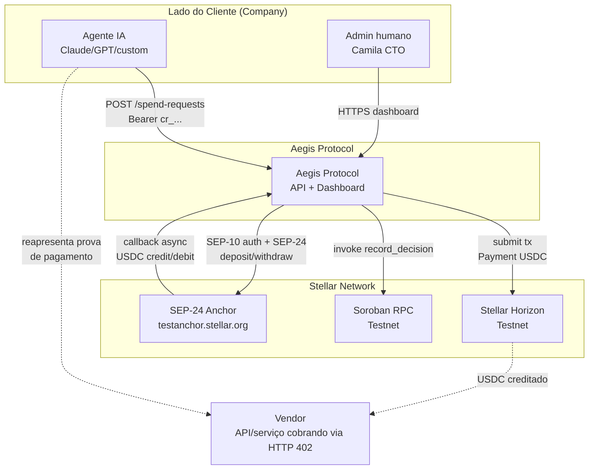
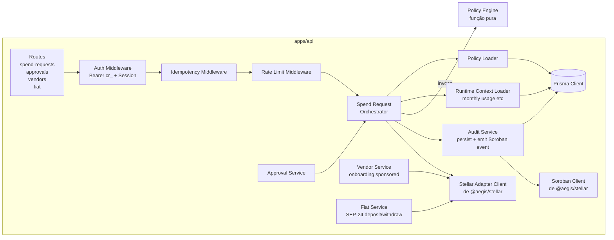
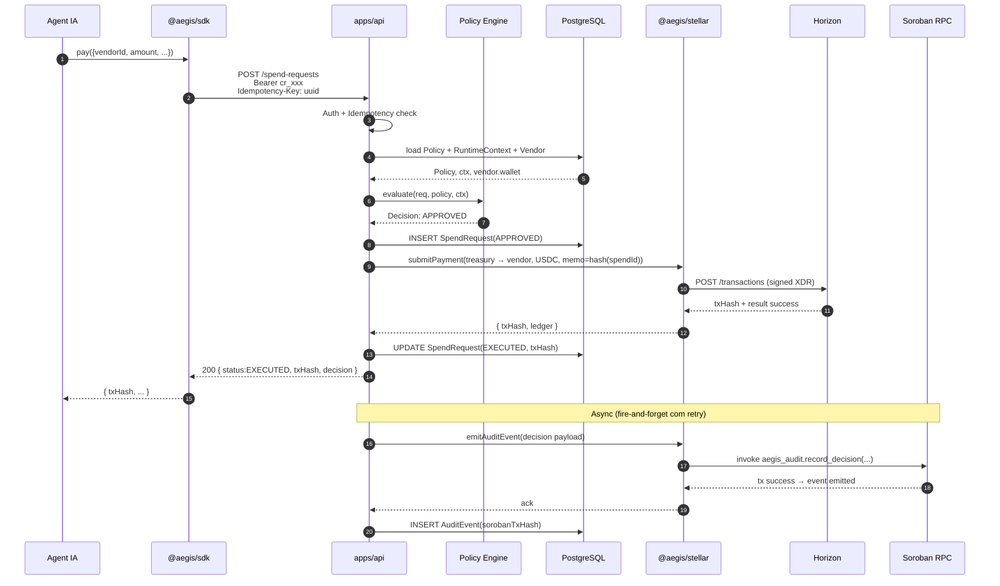
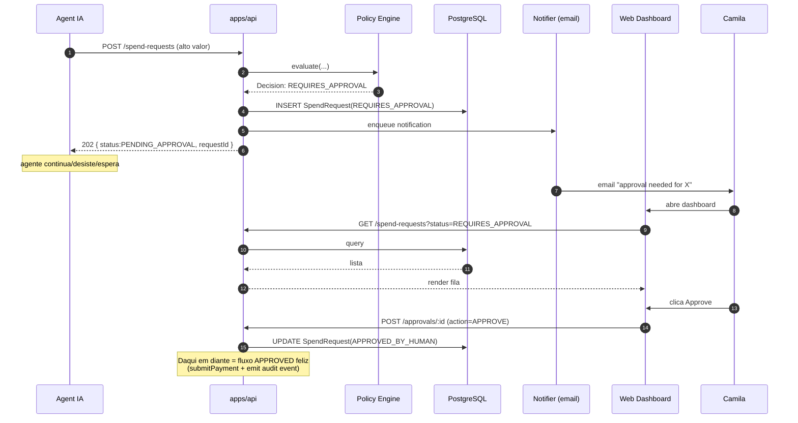
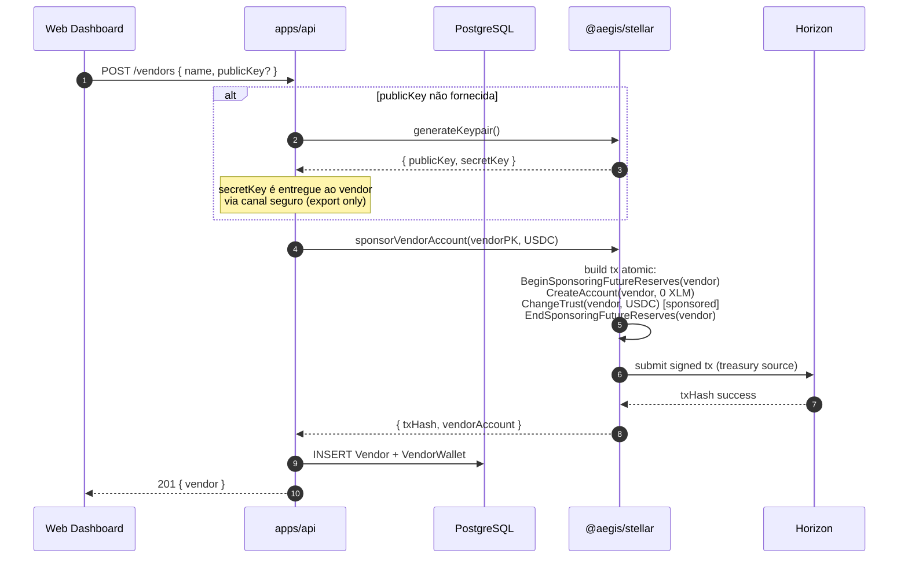
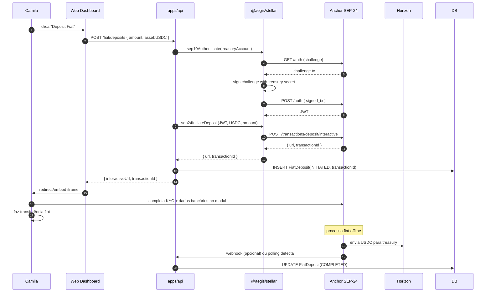
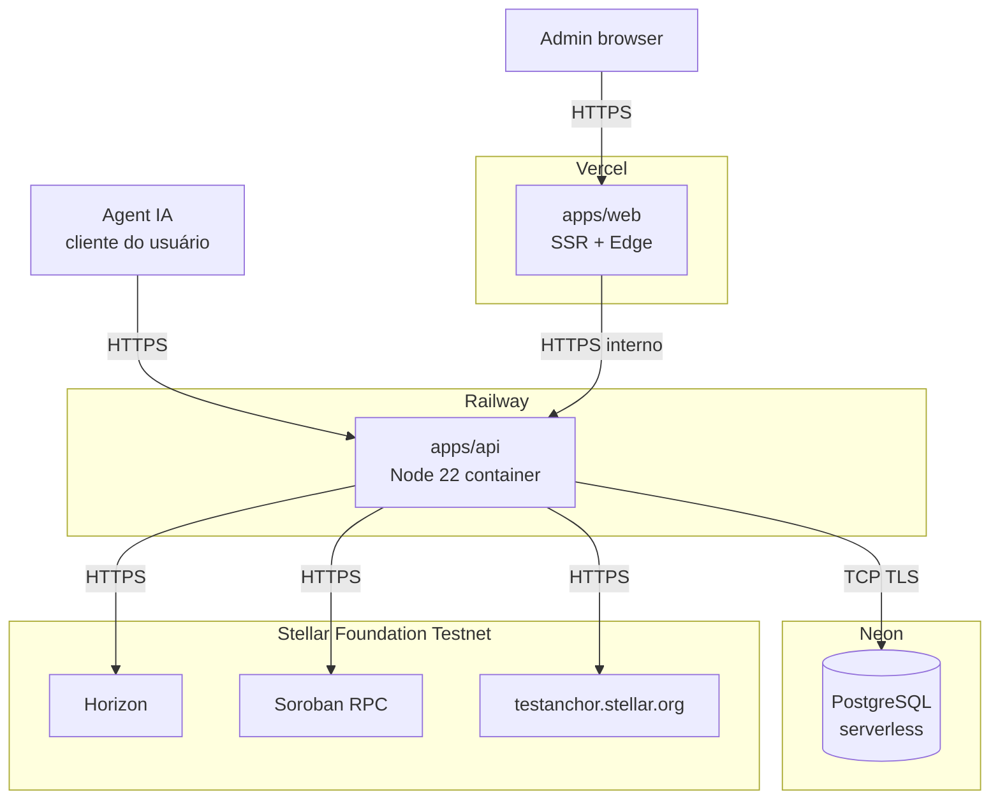

# 02 — Arquitetura

> Visão de arquitetura em camadas C4 (Context → Container → Component) + sequence diagrams dos fluxos críticos.

---

## 1. Princípios arquiteturais

Quatro princípios orientam todas as decisões deste documento. Cada um tem trade-offs explícitos.

### P1 — Núcleo determinístico e puro
O **Policy Engine** é uma função pura, sem I/O, totalmente testável em unidade. Recebe `(SpendRequest, Policy, RuntimeContext)` e retorna `Decision`. Sem `await`, sem rede, sem DB.
- **Trade-off:** runtime context (saldo mensal usado, contadores) precisa ser pré-carregado pelo caller. Aumenta complexidade na borda mas garante latência <100ms e auditabilidade.

### P2 — Custódia simétrica e auditoria simétrica
Agente **nunca** detém chave Stellar — Aegis sim. Toda decisão **sempre** vira evento Soroban (incluindo REJECTED). Trilha simétrica entre o que aconteceu off-chain e on-chain.
- **Trade-off:** Aegis vira ponto único de falha de custódia. Mitigado por roadmap de KMS/multisig no Marco 2.

### P3 — Zero fricção blockchain para o cliente
Company e Vendor nunca precisam ter XLM, abrir trustline manualmente ou entender Stellar. Aegis sponsoreia, paga fees e abstrai via API.
- **Trade-off:** Aegis carrega custo operacional (reserves locked, XLM operacional). Documentado em `docs/05-zero-friction-onboarding.md`.

### P4 — Adapter para opcionalidade futura
`SettlementAdapter` em `@aegis/shared` permite trocar Stellar por outra chain no futuro sem reescrever o núcleo. No MVP só Stellar é implementado.
- **Trade-off:** mais código que "Stellar direto" no curto prazo, ganho de opcionalidade no médio.

---

## 2. C4 — Nível 1: Context

Mostra Aegis Protocol e quem interage com ele.



**Atores externos:**
| Ator | Interage como | Protocolo |
|------|---------------|-----------|
| Agente IA | Cliente programático | REST/HTTPS + SDK TS |
| Admin (Camila) | Cliente humano | HTTPS browser |
| Stellar Horizon | Backend on-chain | REST/HTTPS |
| Soroban RPC | Backend on-chain | JSON-RPC |
| SEP-24 Anchor | Backend fiat | REST/HTTPS + JWT (SEP-10) |
| Vendor | Beneficiário de pagamento | Recebe USDC; opcionalmente expõe HTTP 402 |

---

## 3. C4 — Nível 2: Container

Decomposição interna do "Aegis Protocol" do diagrama anterior.

```mermaid
graph TB
    Agent[Agente IA]
    Admin[Admin]

    subgraph "Aegis Protocol Monorepo"
        Web[apps/web<br/>Next.js 14 App Router<br/>Dashboard]
        API[apps/api<br/>Fastify + TS + Zod<br/>REST gateway]
        Engine[packages/policy-engine<br/>função pura zero I/O]
        Shared[packages/shared<br/>types + SettlementAdapter]
        StellarPkg[packages/stellar<br/>implementação Stellar do Adapter<br/>+ SEP-24 client]
        SDK[packages/sdk<br/>@aegis/sdk para agentes]
        SorobanContract[contracts/aegis-audit<br/>Rust + soroban-sdk]
        DB[(PostgreSQL<br/>Neon serverless)]
    end

    Horizon[Stellar Horizon]
    Soroban[Soroban RPC]
    Anchor[SEP-24 Anchor]

    Agent -->|via @aegis/sdk| API
    Admin -->|HTTPS| Web
    Web -->|REST interno| API
    API -->|invoca| Engine
    API -->|Prisma| DB
    Engine -.->|consome tipos| Shared
    API -.->|consome tipos| Shared
    API -->|usa adapter| StellarPkg
    StellarPkg -->|HTTP| Horizon
    StellarPkg -->|JSON-RPC| Soroban
    StellarPkg -->|SEP-10/24| Anchor
    SorobanContract -.->|deployed em| Soroban
    SDK -.->|cliente HTTP| API
```

### Container responsabilities

| Container | Responsabilidade | Stateful? |
|-----------|------------------|-----------|
| **apps/api** | Receber requests, autenticar, orquestrar (load policy, load context, evaluate, execute on-chain, persistir) | Stateless (DB é o estado) |
| **apps/web** | Dashboard admin: CRUD + aprovação humana + visualização | Stateless (server components) |
| **packages/policy-engine** | Função pura `evaluate(req, policy, ctx) → decision` | Stateless |
| **packages/shared** | Types, Zod schemas, enums, interface `SettlementAdapter` | N/A (biblioteca) |
| **packages/stellar** | Implementação Stellar do `SettlementAdapter`: build tx, sign, submit, query, SEP-24 client, sponsoring helpers | Stateless (cliente HTTP) |
| **packages/sdk** | Cliente TypeScript que agentes importam para chamar a API | Stateless |
| **contracts/aegis-audit** | Contrato Soroban: função `record_decision`, emite evento | Stateless por design (sem storage) |
| **PostgreSQL** | Persistência: Company, Agent, Policy, SpendRequest, Approval, Vendor, VendorWallet, AuditEvent, FiatDeposit, FiatWithdrawal | Stateful (fonte de verdade off-chain) |

---

## 4. C4 — Nível 3: Component (apps/api)

Foco no container mais complexo. Componentes internos do `apps/api`:



**Notas de design:**
- `SpendOrchestrator` é o componente central. Ele compõe Policy Engine puro com I/O na borda.
- `AuditService` faz dupla escrita: DB primeiro (sync), Soroban depois (async com retry queue).
- `Idempotency Middleware` cria lock em `(idempotency_key, company_id)` antes de chegar no orchestrator.

---

## 5. Sequence diagram — Spend Request feliz (APPROVED)



**Notas críticas:**
- Passos 1-13 são síncronos: agente espera. Latência total p95 ≤ 3s.
- Passos 14-17 são assíncronos: resposta ao agente não bloqueia pela emissão do evento Soroban.
- Memo na operação Payment (passo 9) carrega hash do `spendRequestId` como backup off-chain do recibo.

---

## 6. Sequence diagram — Spend Request escalada (REQUIRES_APPROVAL)



---

## 7. Sequence diagram — Vendor Onboarding (Sponsored)



**Custo operacional para Aegis:** ~1 XLM travado em reserves enquanto o sponsorship vive. Recuperável via `RevokeSponsorship` se o vendor for removido.

---

## 8. Sequence diagram — Fiat Deposit (SEP-24)



---

## 9. Modelo de deployment (alto nível)



**Decisões de deployment:**
- **Vercel** para `apps/web`: deploy zero-config, edge runtime para páginas read-only, server components para CRUD.
- **Railway** para `apps/api`: container Node persistente, suporte a workers e cron, fácil escalar verticalmente para o MVP.
- **Neon** para PostgreSQL: serverless, free tier suficiente para MVP, branching para preview environments.
- Secrets (Stellar treasury secret, JWT secret, anchor JWT) em **Railway Secrets**; **nunca** em Vercel (apps/web não toca chave).

---

## 10. Cross-cutting concerns

### 10.1 Observabilidade
- Logs estruturados JSON (pino) com `requestId`, `companyId`, `agentId`, `spendRequestId`.
- Métricas Prometheus expostas em `/metrics` (escopo MVP).
- Tracing OpenTelemetry preparado mas opcional no MVP (decisão registrada em ADR-006 ou futura).

### 10.2 Erros e resiliência
- Erros classificados em: `CLIENT_ERROR` (4xx), `POLICY_ERROR` (rejeição esperada), `STELLAR_ERROR` (rede/horizon), `INTERNAL_ERROR` (bug).
- Retry com backoff exponencial para Soroban event emission (queue persistente em DB).
- Circuit breaker para Horizon se taxa de erro >30% em 1min.

### 10.3 Versionamento de API
- Versão na URL: `/v1/spend-requests`.
- Mudanças breaking → `/v2`.
- Mudanças aditivas em `/v1` com deprecation header.

### 10.4 Multi-tenancy
- `companyId` propagado em todo request (middleware extrai de Bearer cr_ ou da sessão NextAuth).
- Prisma middleware aplica filtro `where: { companyId }` automaticamente.
- Tests específicos para garantir isolamento.

---

## 11. Onde cada decisão chave está documentada

| Decisão | Documento |
|---------|-----------|
| Por que Stellar (não outra chain) | `docs/adr/0001-stellar-only-mvp.md` |
| Por que USDC do anchor (não asset próprio) | `docs/adr/0002-usdc-via-sep24-anchor.md` |
| Por que Soroban contract global | `docs/adr/0003-soroban-contrato-global.md` |
| Por que hot wallet no MVP | `docs/adr/0004-hot-wallet-mvp-kms-mainnet.md` |
| Por que Aegis = client de HTTP 402 | `docs/adr/0005-http-402-como-gateway.md` |
| Por que policy engine puro | `docs/adr/0006-policy-engine-puro-sem-io.md` |
| Por que Prisma + Neon | `docs/adr/0007-prisma-postgresql-neon.md` |
| Por que monorepo | `docs/adr/0008-monorepo-com-turborepo.md` |
| Por que Sponsored Reserves + Fee Bump | `docs/adr/0009-sponsored-reserves-fee-bump.md` |
| Por que kill switch é stretch | `docs/adr/0010-kill-switch-como-stretch-goal.md` |
