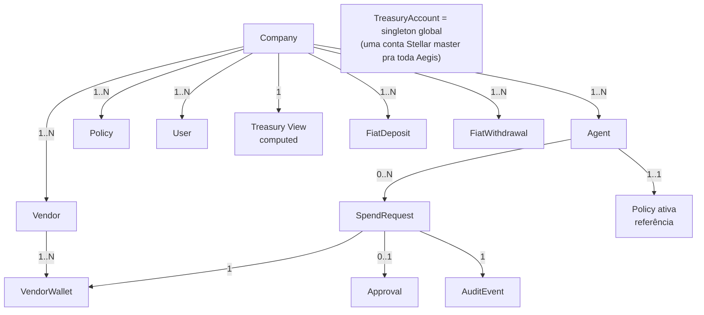
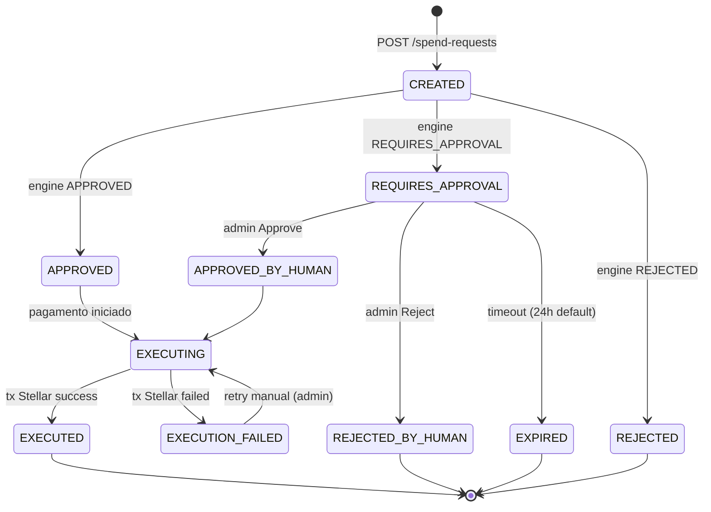

# 03 — Domain Model

> Entidades, agregados, invariantes e glossário. Esta é a fonte de verdade do dicionário de dados do Aegis Protocol.

---

## 1. Visão geral em uma frase

> Uma **Company** opera **Agents** que fazem **SpendRequests** avaliadas contra **Policies**, executadas como pagamentos USDC para **Vendors** com **VendorWallets** sponsoreadas, gerando **AuditEvents** on-chain. Fluxo fiat entra/sai via **FiatDeposits**/**FiatWithdrawals**. Tudo movimenta na única **TreasuryAccount** master.

---

## 2. Mapa de agregados (DDD)



**Boundaries:**
- **Company** é o aggregate root principal (multi-tenant). Toda entidade abaixo pertence a uma única Company.
- **TreasuryAccount** é singleton global (uma só conta Stellar para a infra Aegis inteira no MVP; tenancy é lógica via `companyId` em SpendRequest, não isolamento de chave).
- **SpendRequest** é aggregate root próprio (transição de estado complexa); `Approval` e `AuditEvent` são parte do seu aggregate.

---

## 3. Entidades em detalhe

### 3.1 Company

| Campo | Tipo | Notas |
|-------|------|-------|
| `id` | UUID | PK |
| `name` | string | nome legível |
| `slug` | string | identificador URL-safe único |
| `createdAt` | timestamp | |
| `monthlyBudgetCents` | bigint? | budget global da Company (opcional, default unlimited) |
| `defaultPolicyId` | UUID? | policy aplicada a agentes novos |

**Invariantes:**
- `slug` único globalmente.
- Não pode ser deletada se tem SpendRequest em estado não-terminal.

---

### 3.2 User

| Campo | Tipo | Notas |
|-------|------|-------|
| `id` | UUID | PK |
| `email` | string | único globalmente |
| `name` | string | |
| `companyId` | UUID | FK Company |
| `role` | enum | `OWNER`, `ADMIN`, `VIEWER` |
| `createdAt` | timestamp | |
| `lastLoginAt` | timestamp? | |

**Invariantes:**
- 1 User pertence a 1 Company (MVP; multi-company por user fica para depois).
- Toda Company tem ao menos 1 User com role `OWNER`.

**Auth:** NextAuth (credentials provider no MVP; OAuth Google/GitHub depois).

---

### 3.3 Agent

| Campo | Tipo | Notas |
|-------|------|-------|
| `id` | UUID | PK |
| `companyId` | UUID | FK Company |
| `name` | string | nome legível ("Customer Success Bot") |
| `description` | string? | |
| `apiKeyHash` | string | hash bcrypt/argon2 da API key |
| `apiKeyPrefix` | string | primeiros 8 chars da key (ex: `cr_a8x9k2j`) para listar sem expor full key |
| `activePolicyId` | UUID | FK Policy |
| `status` | enum | `ACTIVE`, `SUSPENDED`, `REVOKED` |
| `createdAt` | timestamp | |
| `revokedAt` | timestamp? | |
| `metadata` | jsonb | tags livres |

**Invariantes:**
- API key (formato `cr_<32 random chars>`) é gerada uma vez, mostrada ao admin uma vez, e armazenada como hash.
- `status=REVOKED` impede toda spend request; soft delete (auditoria mantém).
- Toda spend request referencia o `activePolicyId` no momento da request (snapshot no campo `SpendRequest.policySnapshot`).

---

### 3.4 Policy

| Campo | Tipo | Notas |
|-------|------|-------|
| `id` | UUID | PK |
| `companyId` | UUID | FK Company |
| `name` | string | nome legível |
| `version` | int | incrementa a cada update (immutable; nova versão = novo registro) |
| `rules` | jsonb | DSL declarativo — ver `docs/09-policy-dsl.md` |
| `isActive` | boolean | só uma versão "active" por chain de versões |
| `createdAt` | timestamp | |
| `supersedesPolicyId` | UUID? | versão anterior |

**Invariantes:**
- Policies são **immutables**: editar = criar nova versão e marcar a anterior como `isActive=false`.
- `SpendRequest.policySnapshot` copia `rules` no momento da avaliação para auditoria histórica.

**Exemplo de `rules`:**
```json
{
  "maxPerTransactionCents": 50000,
  "monthlyBudgetCents": 100000000,
  "vendorAllowList": ["vendor-id-1", "vendor-id-2"],
  "vendorDenyList": [],
  "actionTypes": ["api-call", "scraping", "compute"],
  "humanApprovalThresholdCents": 20000
}
```

---

### 3.5 Vendor

| Campo | Tipo | Notas |
|-------|------|-------|
| `id` | UUID | PK |
| `companyId` | UUID | FK Company |
| `name` | string | nome legível ("Apify", "Bittensor subnet 4") |
| `description` | string? | |
| `preferredAsset` | string | asset que o vendor prefere receber. Default `"USDC"`. Aceita qualquer asset emitido por anchor reconhecido com liquidez DEX no par contra USDC (`"EURC"`, `"BRL"`, `"ARS"`, etc.). Determina qual trustline é sponsoreada no onboarding e qual operação Stellar usar no payment (Payment se = USDC; PathPaymentStrictReceive se ≠). Ver [docs/04 §6](../docs/04-stellar-asset-design.md#6-multi-asset-vendor--path-payment-strict-receive). |
| `metadata` | jsonb | tags, URL, contato |
| `status` | enum | `ACTIVE`, `SUSPENDED` |
| `createdAt` | timestamp | |

**Invariantes:**
- Vendor sem nenhum VendorWallet ativo não pode receber pagamento.
- VendorWallet primária do vendor deve ter trustline aberta para `Vendor.preferredAsset`.
- Status `SUSPENDED` faz toda SpendRequest para este vendor cair em REJECTED.
- Mudar `preferredAsset` de vendor existente requer: (a) abrir nova trustline para o novo asset (sponsored), (b) vendor zerar saldo no asset antigo, (c) opcionalmente remover trustline antiga. UX: tratar como "criar novo vendor wallet" em vez de mutar in-place.

---

### 3.6 VendorWallet

| Campo | Tipo | Notas |
|-------|------|-------|
| `id` | UUID | PK |
| `vendorId` | UUID | FK Vendor |
| `publicKey` | string | endereço Stellar (G...) |
| `chain` | enum | `STELLAR` (MVP), preparação para futuras |
| `status` | enum | `PROVISIONING`, `ACTIVE`, `SPONSORED_BY_AEGIS`, `INACTIVE` |
| `trustlines` | jsonb | assets que essa wallet tem trustline (ex: `[{asset:"USDC", issuer:"..."}]`) |
| `sponsorshipTxHash` | string? | hash da tx que criou o sponsorship |
| `createdAt` | timestamp | |
| `isPrimary` | boolean | wallet principal pra receber pagamentos default |

**Invariantes:**
- Cada Vendor tem ≥1 VendorWallet com `isPrimary=true` quando `Vendor.status=ACTIVE`.
- VendorWallet com `status=PROVISIONING` ainda não pode receber pagamento (trustline em curso).
- VendorWallet com `status=SPONSORED_BY_AEGIS` indica que reserves estão custeadas pela treasury Aegis.

---

### 3.7 SpendRequest

**Aggregate root crítico.** Estado e transições mais detalhadas do domínio.

| Campo | Tipo | Notas |
|-------|------|-------|
| `id` | UUID | PK |
| `companyId` | UUID | FK Company (denormalizado para query) |
| `agentId` | UUID | FK Agent |
| `vendorId` | UUID | FK Vendor |
| `vendorWalletId` | UUID? | FK VendorWallet (resolvido na execução) |
| `policyId` | UUID | FK Policy (versão usada) |
| `policySnapshot` | jsonb | cópia do `Policy.rules` no momento da avaliação |
| `amountCents` | bigint | valor em centavos USD (USDC tem 7 decimais Stellar; conversão na borda) |
| `asset` | string | `"USDC"` no MVP |
| `actionType` | string | livre, validado contra `policy.rules.actionTypes` |
| `reason` | string? | texto livre do agente |
| `idempotencyKey` | string | unique com `companyId` |
| `metadata` | jsonb | contexto livre do agente |
| `status` | enum | ver máquina de estado abaixo |
| `decision` | enum | `APPROVED`, `REQUIRES_APPROVAL`, `REJECTED` (da engine) |
| `decisionReason` | string? | "exceeded monthly budget", "vendor in deny list", etc |
| `evaluatedAt` | timestamp? | quando engine rodou |
| `txHash` | string? | hash da tx Stellar (após EXECUTED) |
| `ledger` | int? | número do ledger Stellar |
| `sorobanEventTxHash` | string? | hash da tx do contrato Soroban |
| `executedAt` | timestamp? | |
| `failureReason` | string? | erro se EXECUTION_FAILED |
| `createdAt` | timestamp | |
| `updatedAt` | timestamp | |

**Máquina de estado (`status`):**



**Invariantes:**
- Transição APPROVED → EXECUTED só pode acontecer **uma vez** (lock otimista em `version` ou `status` atual).
- `idempotencyKey` é único por `(companyId, idempotencyKey)`.
- `policySnapshot` é obrigatório a partir do momento que `decision` é setada.
- `txHash` só é setado quando `status=EXECUTED` ou `EXECUTION_FAILED`.
- Toda spend request gera ≥1 `AuditEvent` (mesmo as REJECTED, REJECTED_BY_HUMAN, EXPIRED).

---

### 3.8 Approval

| Campo | Tipo | Notas |
|-------|------|-------|
| `id` | UUID | PK |
| `spendRequestId` | UUID | FK SpendRequest |
| `userId` | UUID | FK User (quem aprovou/rejeitou) |
| `action` | enum | `APPROVED`, `REJECTED` |
| `reason` | string? | texto livre |
| `createdAt` | timestamp | |

**Invariantes:**
- Uma SpendRequest pode ter no máximo 1 Approval com `action=APPROVED` ou `action=REJECTED`.
- Approval só pode ser criado se SpendRequest está em `REQUIRES_APPROVAL`.

---

### 3.9 AuditEvent

| Campo | Tipo | Notas |
|-------|------|-------|
| `id` | UUID | PK |
| `companyId` | UUID | FK Company |
| `spendRequestId` | UUID? | FK SpendRequest (nullable: eventos de admin sem spend) |
| `eventType` | enum | `DECISION_MADE`, `PAYMENT_EXECUTED`, `APPROVAL_REQUESTED`, `APPROVAL_GRANTED`, `APPROVAL_DENIED`, `KILL_SWITCH_ACTIVATED`, `FIAT_DEPOSITED`, `FIAT_WITHDRAWN` |
| `actor` | string | `agent:<id>`, `user:<id>`, `system`, `anchor:<provider>` |
| `payload` | jsonb | dados do evento |
| `sorobanTxHash` | string? | hash da tx Soroban (após emit on-chain) |
| `sorobanEmittedAt` | timestamp? | quando o evento Soroban confirmou |
| `createdAt` | timestamp | quando o evento foi registrado off-chain |

**Invariantes:**
- AuditEvent é **append-only**: nunca editado, nunca deletado.
- `sorobanTxHash` é setado de forma eventual (async com retry). NULL = ainda não emitido (worker está processando).

---

### 3.10 TreasuryAccount

**Singleton global** no MVP (uma só conta Stellar master para toda a Aegis).

| Campo | Tipo | Notas |
|-------|------|-------|
| `id` | UUID | PK (single row) |
| `publicKey` | string | endereço Stellar G... |
| `network` | enum | `TESTNET`, `MAINNET` |
| `secretKeyEnvVar` | string | nome da env var (ex: `TREASURY_SECRET`) — secret nunca em DB |
| `auditContractId` | string? | endereço do contrato Soroban deployado |
| `createdAt` | timestamp | |

**Não persistir secrets em DB. Nunca.** Apenas referência ao nome da env var para auditabilidade.

**View computada (não persistida):** `treasuryBalance` lido em tempo real do Horizon (`accounts/:id`) com cache de 10s.

---

### 3.11 FiatDeposit

| Campo | Tipo | Notas |
|-------|------|-------|
| `id` | UUID | PK |
| `companyId` | UUID | FK Company |
| `userId` | UUID | FK User (quem iniciou) |
| `anchorId` | string | `"stellar-test-anchor"` no MVP |
| `anchorTransactionId` | string | ID do anchor (`transaction_id` do SEP-24) |
| `interactiveUrl` | string | URL do modal SEP-24 |
| `amountCents` | bigint? | valor declarado (anchor pode ajustar) |
| `actualAmountCents` | bigint? | valor real creditado |
| `asset` | string | `"USDC"` |
| `status` | enum | `INITIATED`, `PENDING_USER_INFO`, `PENDING_USER_TRANSFER`, `PROCESSING`, `COMPLETED`, `FAILED`, `REFUNDED` |
| `txHash` | string? | hash da tx Stellar que creditou USDC |
| `createdAt` | timestamp | |
| `completedAt` | timestamp? | |
| `failureReason` | string? | |

---

### 3.12 FiatWithdrawal

Espelho de FiatDeposit, mas no sentido oposto (USDC sai da treasury → anchor → fiat na conta bancária).

| Campo | Tipo | Notas (delta sobre FiatDeposit) |
|-------|------|-------|
| ... | ... | mesmos campos básicos |
| `bankReference` | string? | referência bancária retornada pelo anchor |
| `withdrawalDestination` | jsonb | dados da conta bancária destino (mascarados no display) |

---

## 4. Invariantes globais

1. **Tenant isolation:** toda query MUST filtrar por `companyId` derivado do request context (Bearer cr_ ou session). Prisma middleware aplica isso automaticamente.
2. **Audit completude:** toda transição de `SpendRequest.status` MUST emitir um `AuditEvent` correspondente.
3. **Soroban eventual consistency:** `AuditEvent.sorobanTxHash` é eventualmente preenchido por worker. Se anchor não consegue emitir, fica em retry; alarme se >5min sem sucesso.
4. **Idempotência atomic:** `INSERT SpendRequest` com `(companyId, idempotencyKey)` unique constraint — se conflict, retorna a request existente.
5. **Treasury single source of truth:** o balance "real" é o Horizon, não o DB. DB pode cachear, mas decisões críticas (saldo suficiente) consultam Horizon antes.
6. **Policy immutability:** policies versionadas; alteração = nova versão; auditoria mostra qual versão decidiu.
7. **VendorWallet readiness:** SpendRequest só vai para EXECUTING se `vendor.wallet.status=ACTIVE` e tem trustline para o asset solicitado.

---

## 5. Glossário

| Termo | Definição |
|-------|-----------|
| **Aegis Protocol** | Este produto. Camada de governança econômica para agentes IA. |
| **Agent** | Identidade programática que faz spend requests. Tem API key e policy associada. |
| **Anchor** | Provedor SEP-24 que faz ponte fiat↔crypto. MVP usa `testanchor.stellar.org`. |
| **Approval** | Decisão humana sobre uma spend request escalada. Vira AuditEvent. |
| **Asset** | Token Stellar. No MVP, sempre USDC (do anchor). |
| **AuditEvent** | Registro append-only de algo que aconteceu. Espelhado on-chain via Soroban. |
| **Company** | Tenant da Aegis. Empresa cliente. |
| **Clawback** | Operação Stellar que permite ao issuer de um asset revogar tokens da posse de outro account. Requer `AUTH_CLAWBACK_ENABLED` no asset. Usado no kill switch (stretch). |
| **Decision** | Resultado da Policy Engine: APPROVED, REQUIRES_APPROVAL, REJECTED. |
| **Engine** | A Policy Engine. Função pura, determinística, sem I/O. |
| **Fee Bump (CAP-15)** | Transação Stellar que envelopa outra transação para pagar a fee dela. Não usado por default no Aegis (treasury é source, então paga fee diretamente), mas suportado se vendor iniciar tx. |
| **HTTP 402** | Status code "Payment Required". Vendors usam para pedir pagamento antes de servir recurso. Aegis = client. |
| **Idempotency Key** | UUID que o agente envia para evitar pagamento duplo em retry. |
| **Issuer** | Account Stellar que emite um asset. USDC tem issuer Circle; aUSD (stretch) teria issuer Aegis. |
| **Kill Switch** | Stretch goal: revogar tokens da treasury via Clawback se comprometida. |
| **Memo** | Campo de até 32 bytes anexado a uma transação Stellar. Aegis usa para hash do spendRequestId. |
| **Network Passphrase** | Identificador da rede Stellar. Testnet: `"Test SDF Network ; September 2015"`. Mainnet: `"Public Global Stellar Network ; September 2015"`. |
| **Path Payment Strict Receive** | Operação Stellar `PathPaymentStrictReceive` que faz conversão atomic entre dois assets via DEX nativa, garantindo que o destinatário receba **exatamente** o `destAmount` especificado. Aegis usa para pagar vendors em assets ≠ USDC (ex: vendor brasileiro recebe BRL enquanto treasury despende USDC). Atomic: ou tudo dá certo, ou nada acontece. |
| **Path Payment Strict Send** | Variante onde a source despende **exatamente** o `sendAmount`. Não usado no fluxo padrão Aegis (queremos garantir valor exato no vendor, não na treasury). |
| **Preferred Asset** | Asset que cada vendor declara preferir receber. Persistido em `Vendor.preferredAsset` (default `"USDC"`). Determina qual trustline é sponsoreada no onboarding e qual operação Stellar usar no pagamento (Payment se = USDC; PathPaymentStrictReceive se ≠). |
| **Policy** | Regras declarativas que a engine avalia. Versionada e imutável. |
| **Policy Snapshot** | Cópia das rules da policy gravada na SpendRequest no momento da decisão (auditoria histórica). |
| **REST** | Estilo de API HTTP. Aegis API é REST + JSON. |
| **Reserves** | XLM mínimo travado por account/trustline na Stellar (base reserve = 0.5 XLM, +0.5 por sub-entry). |
| **SDK** | `@aegis/sdk`, cliente TypeScript para agentes. |
| **SEP-10** | Protocolo de auth Stellar (signed challenge transaction). Pré-requisito para SEP-24. |
| **SEP-24** | Protocolo de hosted deposit/withdraw com anchor (KYC + UI interativa). |
| **Soroban** | Plataforma de smart contracts da Stellar. Contratos em Rust. |
| **Soroban RPC** | Endpoint JSON-RPC para invocar contratos e consultar eventos. |
| **Sponsored Reserves (CAP-33)** | Mecanismo Stellar onde uma account paga as reserves de outra. Aegis sponsoreia vendors. |
| **SpendRequest** | Pedido de gasto do agente. Aggregate root. |
| **Trustline** | Permissão de uma account para holdar um asset não-native. Vendor precisa ter trustline USDC antes de receber. |
| **Treasury** | Account Stellar master da Aegis. Holda USDC operacional + XLM para sponsorships/fees. |
| **TreasuryAccount** | Entidade DB que referencia a treasury. Não armazena chave; aponta para env var. |
| **USDC** | Stablecoin lastreada em USD. Emitida por Circle na Stellar. No testnet, asset USDC do test-anchor. |
| **Vendor** | Quem recebe o pagamento. Cadastrado pela Company. |
| **VendorWallet** | Account Stellar do vendor. Pode ser provida pelo vendor ou gerada+sponsoreada pela Aegis. |
| **XLM** | Asset nativo da Stellar (Lumens). Usado para reserves e fees. |
