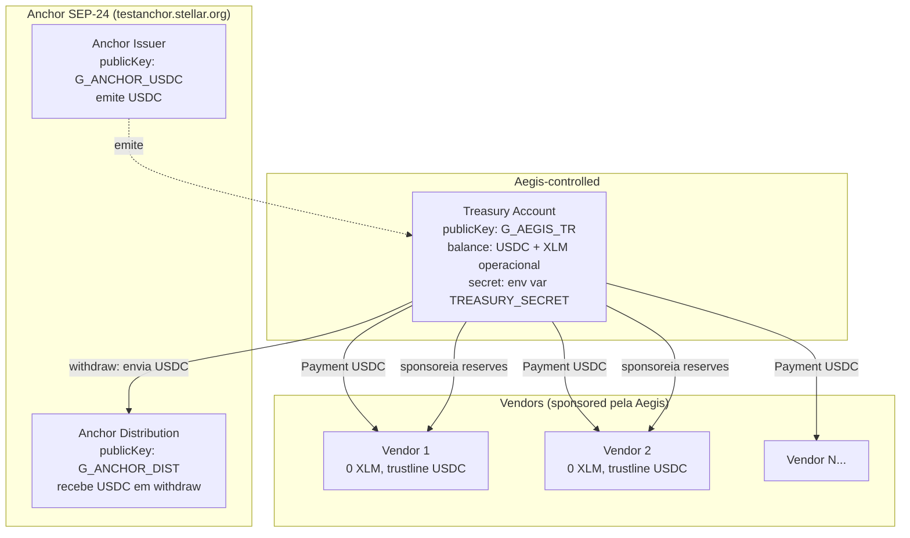

# 04 — Stellar Asset Design

> Como Aegis modela accounts, assets, trustlines e operações na rede Stellar. Documento técnico crítico — toda decisão on-chain deriva daqui.

---

## 1. Resumo de uma página

- **Asset operacional da treasury:** **USDC** do anchor SEP-24 (testnet: `testanchor.stellar.org`). Treasury holda APENAS USDC + XLM operacional — nunca múltiplos assets.
- **Treasury:** 1 account Stellar master da Aegis (singleton no MVP). Holda USDC + XLM para fees e sponsorships.
- **Aegis NÃO é issuer no MVP** — o USDC é emitido pelo anchor. Trade-off: sem kill switch via Clawback (stretch goal S1 designa asset `aUSD` separado quando essa feature for implementada).
- **Vendor escolhe seu asset preferido** (`Vendor.preferredAsset`): USDC, EURC, BRL, ARS — qualquer asset com anchor reconhecido + liquidez DEX no par contra USDC.
- **Vendors são sponsoreados** (CAP-33): Aegis cria account do vendor com 0 XLM e abre trustline para o `preferredAsset` (não fixo em USDC). Custo: ~1 XLM travado em reserves da treasury enquanto a relação dura.
- **Pagamento ramifica por asset:** se `preferredAsset = USDC` → operação `Payment` direta. Se `≠ USDC` → operação `PathPaymentStrictReceive` converte USDC → asset destino atomicamente via DEX nativa Stellar (vendor recebe exatamente o valor; treasury despende USDC + slippage).
- **Toda transação tem source = treasury** (Aegis paga fees). Fee bump não é o padrão.
- **Memo** em cada operação carrega `sha256(spendRequestId)` como backup off-chain do recibo.

---

## 2. Topologia de accounts



**Decisões:**
- **Treasury singleton** (1 account para toda Aegis). Tenancy é lógica (companyId no DB), não cripto. Trade-off: simplicidade vs isolamento; aceitável no MVP, revisado no Marco 2/3.
- **Vendors não compartilham reserves:** cada vendor é uma account própria, sponsoreada individualmente. Isso isola vendors entre si e permite revogação granular.

---

## 3. Setup da Treasury (one-time)

Procedimento manual na primeira vez que a Aegis sobe num ambiente. Documentar passos como script `apps/api/src/scripts/setup-treasury.ts`.

### Passos
1. **Gerar keypair** (offline ou via `StrKey`):
   ```ts
   const kp = Keypair.random();
   console.log('publicKey:', kp.publicKey()); // G...
   console.log('secretKey:', kp.secret());    // S... → vai pra env TREASURY_SECRET
   ```
2. **Fundar com Friendbot** (testnet only):
   ```bash
   curl "https://friendbot.stellar.org?addr=G_AEGIS_TR"
   # treasury recebe ~10.000 XLM testnet
   ```
3. **Estabelecer trustline USDC do anchor:**
   ```ts
   // descobrir issuer USDC do anchor via SEP-1 stellar.toml
   const anchorToml = await fetch('https://testanchor.stellar.org/.well-known/stellar.toml');
   const usdcIssuer = /* parsed from toml CURRENCIES */;
   const tx = new TransactionBuilder(treasury, { fee, networkPassphrase: TESTNET })
     .addOperation(Operation.changeTrust({ asset: new Asset('USDC', usdcIssuer) }))
     .setTimeout(30)
     .build();
   tx.sign(treasuryKey);
   await server.submitTransaction(tx);
   ```
4. **Deployar contrato Soroban `aegis_audit`** e gravar `auditContractId` na env / DB:
   ```bash
   stellar contract deploy \
     --wasm target/wasm32-unknown-unknown/release/aegis_audit.wasm \
     --source treasury \
     --network testnet
   # → retorna contract ID; salvar em AUDIT_CONTRACT_ID
   ```
5. **Persistir registro no DB** na tabela `TreasuryAccount`:
   ```sql
   INSERT INTO treasury_account (id, public_key, network, secret_key_env_var, audit_contract_id)
   VALUES (uuid(), 'G_AEGIS_TR', 'TESTNET', 'TREASURY_SECRET', 'C...');
   ```

### Saldo mínimo recomendado na treasury
- **USDC:** depende da operação; começa em 100 USDC para demos.
- **XLM operacional:** mínimo 100 XLM (testnet, fácil reabastecer via Friendbot).
  - Por que: cada sponsorship trava ~1 XLM; cada tx custa ~0.00001 XLM (negligível em volume); reserves da própria treasury (~2 XLM com trustline USDC + audit contract data).
- **Alerta:** logar warning quando XLM operacional < 50.

---

## 4. Onboarding do Vendor (Sponsored)

Detalhes do fluxo. Implementado em `packages/stellar/src/sponsoring.ts`.

### Transação atomic única
```ts
async function sponsorVendor(
  vendorPublicKey: string,
  preferredAssetCode: string = 'USDC',  // vendor declara: USDC, EURC, BRL, ARS, ...
): Promise<{ txHash: string }> {
  const treasury = await server.loadAccount(TREASURY_PUBLIC_KEY);
  const preferredAsset = resolveAsset(preferredAssetCode); // mapping em packages/stellar/src/assets.ts

  const tx = new TransactionBuilder(treasury, {
    fee: BASE_FEE,
    networkPassphrase: TESTNET_PASSPHRASE,
  })
    // 1. Aegis começa a sponsorear o vendor
    .addOperation(Operation.beginSponsoringFutureReserves({
      sponsoredId: vendorPublicKey,
    }))
    // 2. Cria a account do vendor com 0 XLM
    .addOperation(Operation.createAccount({
      destination: vendorPublicKey,
      startingBalance: '0',
    }))
    // 3. Abre trustline para o ASSET ESCOLHIDO pelo vendor (USDC default, ou EURC/BRL/etc)
    //    (vendor precisa "assinar" essa op pra autorizar a trustline)
    .addOperation(Operation.changeTrust({
      source: vendorPublicKey,
      asset: preferredAsset,  // ← não fixo em USDC; usa o asset preferido
    }))
    // 4. Aegis encerra o sponsorship — daqui pra frente reserves ficam locked na treasury
    .addOperation(Operation.endSponsoringFutureReserves({
      source: vendorPublicKey,
    }))
    .setTimeout(60)
    .build();

  // Assinar com AMBAS as chaves: treasury + vendor
  tx.sign(treasuryKey);
  tx.sign(vendorKey); // ← vendor precisa assinar ChangeTrust e EndSponsoring

  const result = await server.submitTransaction(tx);
  return { txHash: result.hash };
}
```

### Resolução de assets
`resolveAsset(code: string): Asset` consulta uma whitelist mantida em código (`packages/stellar/src/assets.ts`) com `{ code, issuer }` por network. Adicionar novo asset = PR + revisão (auditável via git, sem dynamic asset resolution risk). Detalhes do mapping na seção §6.

### Por que vendor precisa assinar
Operations `ChangeTrust` e `EndSponsoringFutureReserves` requerem assinatura do account vendor — mesmo que reserves sejam da treasury, a permissão para "abrir trustline" e "aceitar fim do sponsorship" pertence ao vendor.

### Modos de obter a assinatura do vendor

**Modo A (default no MVP): Aegis gera o keypair do vendor**
- Aegis cria `Keypair.random()`, assina como vendor + treasury, e armazena `vendor.secretKey` para uso posterior (transferência segura para o vendor real ou Aegis continua custodiando).
- Mais simples; vendor não precisa fazer nada.
- **Custódia da chave do vendor:** mesmas precauções da treasury (env var ou KMS).

**Modo B (opcional, para vendors técnicos): vendor fornece publicKey + assina out-of-band**
- Aegis monta XDR não assinada e devolve para o vendor assinar com sua wallet (Freighter, etc.) e mandar de volta para submit.
- Mais friction, mas vendor mantém custódia da própria chave.
- Suportado no MVP via flag `vendor.signMode = "SELF" | "AEGIS"`.

**Recomendação:** começar com Modo A no MVP por simplicidade. Modo B é fácil de adicionar depois.

### Custos de sponsorship
| Item | Reserves locked |
|------|-----------------|
| Account base | 0.5 XLM |
| Trustline USDC | 0.5 XLM |
| **Total por vendor** | **1.0 XLM** |

Com 100 vendors sponsoreados, treasury tem 100 XLM travado (recuperável). Documentar como custo operacional.

### Revogar sponsorship (futuro)
Endpoint `DELETE /vendors/:id` pode emitir operação `RevokeSponsorship` para recuperar as reserves. Não está no MVP, mas o design suporta.

---

## 5. Fluxo de Pagamento (treasury → Vendor) — ramifica por asset

Fluxo central do produto. **Ramifica em 2 caminhos** dependendo do `Vendor.preferredAsset`:
- **Caminho A** (vendor com `preferredAsset = "USDC"`): operação `Payment` direta.
- **Caminho B** (vendor com `preferredAsset ≠ "USDC"`, ex: EURC/BRL): operação `PathPaymentStrictReceive` (ver §6).

```ts
async function executePayment(
  spendRequest: SpendRequest,
  vendor: Vendor,
  vendorWallet: VendorWallet,
) {
  const treasury = await server.loadAccount(TREASURY_PUBLIC_KEY);
  const memoHash = createHash('sha256').update(spendRequest.id).digest();
  const destAsset = resolveAsset(vendor.preferredAsset); // USDC|EURC|BRL|...

  const txBuilder = new TransactionBuilder(treasury, {
    fee: BASE_FEE * 2, // safety margin
    networkPassphrase: TESTNET_PASSPHRASE,
  });

  if (assetsEqual(destAsset, USDC_ASSET)) {
    // Caminho A — Payment USDC → USDC (sem conversão)
    txBuilder.addOperation(Operation.payment({
      destination: vendorWallet.publicKey,
      asset: USDC_ASSET,
      amount: centsToAssetString(spendRequest.amountCents),
    }));
  } else {
    // Caminho B — Path Payment USDC → destAsset (conversão atomic via DEX)
    // Detalhes completos do path calculation, slippage e error handling em §6
    const op = await buildPathPaymentStrictReceive({
      sendAsset: USDC_ASSET,
      destAsset,
      destAmount: centsToAssetString(spendRequest.amountCents),
      destination: vendorWallet.publicKey,
      slippageTolerance: spendRequest.policySnapshot.pathPaymentSlippage ?? 0.01,
    });
    txBuilder.addOperation(op);
  }

  const tx = txBuilder.addMemo(Memo.hash(memoHash)).setTimeout(60).build();
  tx.sign(treasuryKey);

  try {
    const result = await server.submitTransaction(tx);
    return { txHash: result.hash, ledger: result.ledger };
  } catch (err) {
    // classificar erro: trustline_missing, underfunded, path_not_found, exceeds_slippage, etc.
    throw new StellarPaymentError(err);
  }
}
```

### Conversão centavos USD → string USDC Stellar
- USDC na Stellar tem 7 casas decimais (`AssetType.credit_alphanum4` precision = 7).
- `centsToUsdcString(1234)` (=$12.34) → `"12.3400000"`.
- Implementar com `decimal.js` ou `bignumber.js` (NUNCA com float).

### Erros possíveis ao submeter
| Erro Horizon | Significado | Resposta Aegis |
|--------------|-------------|----------------|
| `op_no_trust` | Vendor não tem trustline USDC | Marca `VendorWallet.status = INACTIVE`, fail SpendRequest |
| `op_underfunded` | Treasury sem USDC suficiente | Fail SpendRequest, alert admin |
| `tx_insufficient_fee` | Fee baixa | Retry com fee maior (exponential backoff) |
| `tx_bad_seq` | Sequence number stale | Recarregar treasury account, retry |
| `tx_too_late` | Timeout expirou | Retry com novo timeout |

---

## 6. Multi-asset vendor — Path Payment Strict Receive (ATIVO no MVP)

Capability **ativa do MVP**, implementando o RF11. Vendor escolhe receber em USDC, EURC, BRL, ARS — Aegis converte USDC → asset destino atomicamente.

### Por que multi-asset
- Vendor brasileiro prefere receber **BRL** (familiar, sem precisar converter ele mesmo depois).
- Vendor europeu prefere **EURC**.
- Vendor cripto-nativo aceita **USDC**.
- Aegis acomoda todos sem holdar múltiplos assets na treasury — converte na hora via DEX nativa Stellar.

### O fluxo (Caminho B do §5)
1. Vendor cadastrado com `preferredAsset = "EURC"` (por exemplo).
2. Onboarding sponsoreia trustline para EURC (não USDC).
3. Agente faz spend request normalmente; orchestrator detecta `vendor.preferredAsset ≠ "USDC"`.
4. Aegis monta `PathPaymentStrictReceive`:

```ts
async function buildPathPaymentStrictReceive(params: {
  sendAsset: Asset;
  destAsset: Asset;
  destAmount: string;        // ex: '15.0000000' (vendor recebe exatamente 15 EURC)
  destination: string;
  slippageTolerance: number; // ex: 0.01 (1%)
}): Promise<xdr.Operation> {
  // 1. Descobrir o melhor path via Horizon
  const paths = await server
    .strictReceivePaths([params.sendAsset], params.destAsset, params.destAmount)
    .call();

  if (paths.records.length === 0) {
    throw new PathNotFoundError(
      `No DEX liquidity for ${params.sendAsset.code} → ${params.destAsset.code}`
    );
  }

  const bestPath = paths.records[0];
  const sendMax = applySlippage(bestPath.source_amount, params.slippageTolerance);
  // ex: bestPath.source_amount = '15.20' USDC; sendMax = '15.35' USDC (com 1% slippage)

  return Operation.pathPaymentStrictReceive({
    sendAsset: params.sendAsset,
    sendMax,
    destination: params.destination,
    destAsset: params.destAsset,
    destAmount: params.destAmount,
    path: bestPath.path.map(p => new Asset(p.asset_code, p.asset_issuer)),
  });
}
```

5. Stellar DEX executa atomic: USDC sai da treasury, EURC chega no vendor — ou nada acontece.

### Pré-requisitos operacionais

**Liquidez DEX para o par USDC ↔ preferredAsset:**
- **Mainnet:** anchors como Anclap (BRL/ARS/EURC/USDC), Circle (USDC/EURC), Tempo (EURC) mantêm pares ativos. Confiável.
- **Testnet:** test-anchor pode ter liquidez limitada. Validar com `server.orderbook(USDC, EURC).call()` antes de prometer demo multi-asset. Pior caso: Aegis cria order pequeno manualmente (atua como market maker temporário só para demo) via `Operation.manageBuyOffer` ou `manageSellOffer`.

**Slippage tolerance** configurável por Company (`Policy.rules.pathPaymentSlippage`, default 0.01 = 1%).

**Falhas tratadas explicitamente:**
| Erro Horizon / Aegis | Significado | Resposta |
|----------------------|-------------|----------|
| `PATH_NOT_FOUND` (sem records) | Sem liquidez no order book | SpendRequest vira `EXECUTION_FAILED` com mensagem clara; admin pode tentar outro asset |
| `op_under_dest_min` | Mercado moveu durante o submit; slippage excedido | Falha; admin pode aumentar slippage e retry |
| `op_no_trust` (vendor) | Vendor sem trustline para destAsset | Marca VendorWallet como INACTIVE; fail |

### Mapping de assets suportados

`packages/stellar/src/assets.ts` mantém whitelist:

| asset_code | network | issuer (resolvido) | anchor |
|------------|---------|--------------------|--------|
| USDC | testnet | (via testanchor.stellar.org TOML) | Stellar test-anchor |
| USDC | mainnet | `GA5ZSEJYB37JRC5AVCIA5MOP4RHTM335X2KGX3IHOJAPP5RE34K4KZVN` | Circle |
| EURC | mainnet | (Circle EURC issuer) | Circle |
| BRL | mainnet | (Anclap BRL issuer) | Anclap |
| ARS | mainnet | (Anclap ARS issuer) | Anclap |
| XLM | both | (native, sem issuer) | nativo |

Adicionar novo asset = PR + revisão (auditável via git, sem dynamic asset resolution risk em runtime).

### O que NÃO é Path Payment no MVP
- **Cross-currency entre 2 anchors no on-ramp fiat.** Treasury continua holdando só USDC; deposit fiat traz USDC, withdraw fiat envia USDC. Multi-anchor para ramp é Marco 3.
- **Path com pivôs intermediários complexos manuais.** Usamos o `path` recomendado pelo Horizon (max 2-3 hops). Se Horizon não acha caminho, falha — não tentamos otimizar manualmente.
- **Strict Send variant.** Usamos `StrictReceive` porque queremos garantir valor exato no vendor (não o valor que a treasury despende).

---

## 7. Stretch S1 — Asset Aegis-issued (`aUSD`) + Kill Switch

**Não implementar no MVP.** Documentado aqui para referência futura.

### Design
- Criar account separada `G_AEGIS_ISSUER` para ser o issuer do asset `aUSD`.
- No SetOptions inicial dessa account: flags `AUTH_REVOCABLE_FLAG=true` e `AUTH_CLAWBACK_ENABLED=true`.
- Treasury operacional passa a holdar paralelamente: USDC (do anchor) + `aUSD`.
- Quando agente faz spend, Aegis pode optar entre:
  - Pagar USDC direto (default; sem kill switch sobre esse pagamento).
  - Pagar `aUSD` (governance asset; kill switch ativável).
- Vendor precisa ter trustline para `aUSD` se for receber esse asset.

### Operação Clawback (kill switch)
```ts
const tx = new TransactionBuilder(issuer, { fee, networkPassphrase: TESTNET })
  .addOperation(Operation.clawback({
    asset: A_USD_ASSET,
    from: TREASURY_PUBLIC_KEY,
    amount: balance, // tudo
  }))
  .build();
tx.sign(issuerKey); // ATENÇÃO: chave do issuer, MUITO mais sensível
```

### Quarentena
Tokens revogados via Clawback "voltam" para o issuer. Issuer transfere para uma quarantine account dedicada (multisig 2-de-3 com humanos no MVP) — visível no Stellar Expert como ação on-chain.

### Por que stretch
Adiciona complexidade significativa:
- Gerenciar 2 assets na treasury (USDC + aUSD) com swap entre eles (path payment ou DEX manual).
- Custódia da chave do issuer (mais sensível que treasury).
- Vendors precisam trustline `aUSD` adicional.
- Liquidez DEX `aUSD`↔USDC se não houver maker (Aegis precisa atuar como maker).

Decisão D12 confirma: stretch goal S1 do roadmap, só implementar após Marco 1 completo.

---

## 8. Network details

### Testnet (MVP)
- Horizon: `https://horizon-testnet.stellar.org`
- Soroban RPC: `https://soroban-testnet.stellar.org`
- Network Passphrase: `"Test SDF Network ; September 2015"`
- Friendbot: `https://friendbot.stellar.org?addr=<account>` (fundar com 10k XLM)
- Anchor: `https://testanchor.stellar.org`
- Stellar Expert: `https://stellar.expert/explorer/testnet`

### Mainnet (Marco 3, não MVP)
- Horizon: `https://horizon.stellar.org`
- Soroban RPC: `https://soroban-rpc.mainnet.stellar.gateway.fm` (ou Blockdaemon, NodeReal, etc.)
- Network Passphrase: `"Public Global Stellar Network ; September 2015"`
- USDC issuer: `GA5ZSEJYB37JRC5AVCIA5MOP4RHTM335X2KGX3IHOJAPP5RE34K4KZVN` (Circle official)
- Stellar Expert: `https://stellar.expert/explorer/public`

---

## 9. Configuração via env vars (relacionado a Stellar)

```bash
# Network
STELLAR_NETWORK=testnet                         # testnet|mainnet
STELLAR_HORIZON_URL=https://horizon-testnet.stellar.org
STELLAR_NETWORK_PASSPHRASE="Test SDF Network ; September 2015"
SOROBAN_RPC_URL=https://soroban-testnet.stellar.org

# Treasury (custódia)
TREASURY_PUBLIC_KEY=G...
TREASURY_SECRET=S...                            # ← NEVER commit, env apenas

# Anchor SEP-24
SEP24_ANCHOR_HOME_DOMAIN=testanchor.stellar.org
SEP24_ANCHOR_TOML_URL=https://testanchor.stellar.org/.well-known/stellar.toml

# Audit contract
AUDIT_CONTRACT_ID=C...                          # Soroban contract address

# Asset operacional
USDC_ASSET_CODE=USDC
USDC_ASSET_ISSUER=G...                          # descoberto via anchor stellar.toml
```

---

## 10. Checklist de validação on-chain (MVP done)

Validar manualmente em testnet ao final do Marco 1:
- [ ] Treasury account existe e está fundada com >100 XLM operacional.
- [ ] Trustline USDC ativa na treasury (Stellar Expert mostra).
- [ ] 1+ vendor sponsoreado com 0 XLM, trustline USDC ativa, recebeu 1+ payment.
- [ ] **1+ vendor sponsoreado com `preferredAsset` ≠ USDC (ex: EURC ou BRL), com trustline desse asset, recebeu 1+ payment via `PathPaymentStrictReceive` — visível no Stellar Expert como path operation.**
- [ ] Spend request → tx visível no Stellar Expert com Memo hash correto.
- [ ] Evento Soroban consultável: `curl SOROBAN_RPC -d '{"method":"getEvents", ...}'` retorna entry com topic `["aegis","decision","<companyId>"]`.
- [ ] Fiat deposit completo via test-anchor → USDC creditado na treasury → status `COMPLETED` no DB.
- [ ] Fiat withdraw completo via test-anchor → USDC saiu da treasury → status `COMPLETED`.
