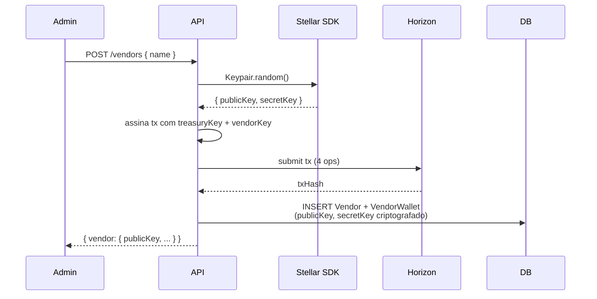
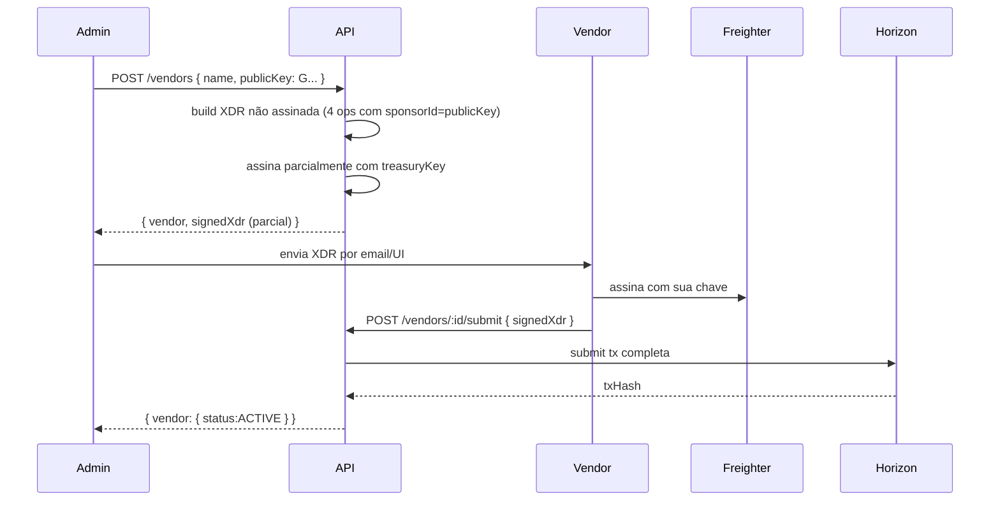

# 05 — Zero-Friction Onboarding

> Como Aegis usa Sponsored Reserves (CAP-33) e Fee Bump (CAP-15) da Stellar para que Company e Vendor **nunca precisem ter XLM nem entender blockchain**. Diferencial de produto crítico.

---

## 1. Tese de produto

> "Se eu, vendor, preciso comprar XLM para abrir uma trustline e receber USDC do agente do meu cliente, eu desisto. Pagamento feito por agentes de IA só pega tração se a fricção blockchain for invisível."

Esta seção descreve como tornamos a fricção blockchain invisível, usando primitivos nativos da Stellar (não giambias de UX).

---

## 2. As duas armadilhas da Stellar UX padrão

### Armadilha 1: Account creation
- Toda account Stellar precisa de **base reserve** (0.5 XLM testnet/mainnet).
- Vendor que nunca tocou em cripto precisa comprar XLM em alguma exchange para criar account. **Já perdemos 80% dos vendors potenciais.**

### Armadilha 2: Trustline
- Para receber qualquer asset não-XLM (USDC, EURC, etc.), account precisa abrir **trustline**.
- Trustline também consome **0.5 XLM de reserve**. Mais XLM necessário.
- Trustline também exige assinatura do account dono.

**Soma:** vendor precisa pelo menos 1 XLM (~$0.10) só pra existir e receber USDC. Pequeno em valor absoluto, **grande em fricção operacional** (compra, transferência, espera de confirmação, gestão de chave para o XLM dele).

---

## 3. A solução nativa: CAP-33 (Sponsored Reserves)

Stellar Protocol 14 introduziu **Sponsored Reserves**: uma account A pode pagar os reserves de uma account B. As reserves continuam contadas em B (e travadas no B), mas o XLM que as cobre vem de A.

**Aplicação no Aegis:**
- Treasury Aegis = sponsor (paga reserves).
- Vendor account = sponsored (tem reserves mas zero XLM próprio).
- Vendor recebe USDC normalmente, **sem nunca ter tocado em XLM**.

### Mecânica em 1 transação atomic
```
Operation 1: BeginSponsoringFutureReserves(sponsoredId: vendor)
                ↑ assinada pela treasury (sponsor)
Operation 2: CreateAccount(destination: vendor, startingBalance: 0)
                ↑ vendor é criado com 0 XLM
Operation 3: ChangeTrust(source: vendor, asset: <vendor.preferredAsset>)
                ↑ asset escolhido pelo vendor: USDC (default), EURC, BRL, ARS, etc.
                ↑ trustline aberta; reserves cobertas pela treasury
                ↑ MAS precisa assinatura do vendor (CAP-33 não bypassa autorização)
Operation 4: EndSponsoringFutureReserves(source: vendor)
                ↑ vendor confirma fim do sponsoring
                ↑ precisa assinatura do vendor
```

**Resultado:**
- Vendor account existe, com 0 XLM.
- Trustline USDC ativa.
- ~1 XLM de reserves locked na treasury Aegis (recuperável via RevokeSponsorship).
- Vendor pronto para receber USDC.

### Custo operacional
| Recurso travado | XLM | Quem paga |
|-----------------|-----|-----------|
| Vendor account base reserve | 0.5 | Treasury Aegis |
| Vendor trustline reserve | 0.5 | Treasury Aegis |
| Fee da transação (4 ops) | ~0.00004 | Treasury Aegis |
| **Total por vendor onboarded** | **~1.0 XLM** | **Treasury Aegis** |

**Recuperação:** quando vendor é desabilitado (`DELETE /vendors/:id`), Aegis emite `RevokeSponsorship` para liberar os 1 XLM de volta para a treasury.

### Limite prático
Com 1 XLM testnet = ~$0.10, e Friendbot fundando 10k XLM de uma vez, Aegis pode sponsorear ~10.000 vendors em testnet sem reabastecer. Em mainnet, a economia precisa de planejamento (ver `docs/11-roadmap.md`).

---

## 4. Como obter assinatura do vendor (o "porém" do CAP-33)

CAP-33 cobre os **reserves**, mas não bypassa autorização. Operations `ChangeTrust` e `EndSponsoringFutureReserves` precisam ser assinadas pela account vendor.

**Opções:**

### Modo A (default no MVP): Aegis gera o keypair do vendor


- **Vantagem:** zero passos para o vendor. Funciona até para vendors completamente não-técnicos (Aegis pode literalmente mandar email com publicKey: "tua wallet existe, vai receber USDC aqui").
- **Trade-off:** Aegis custodia a chave do vendor. **Para MVP testnet é aceitável**; para mainnet, considerar:
  - Cifragem em rest (KMS) por vendor.
  - Migrar para Modo B sob demanda quando vendor pede.
  - Documentar claramente no termo de uso.

### Modo B (opcional, vendor técnico): vendor fornece publicKey + assina out-of-band


- **Vantagem:** vendor mantém custódia da própria chave (vendors técnicos preferem isso).
- **Trade-off:** mais fluxo, requer vendor ter wallet (Freighter, LOBSTR, hardware) configurada.

**Decisão MVP:** implementar Modo A primeiro. Modo B fica para após o Marco 1 (poucos vendors técnicos no início).

---

## 5. Fee Bump (CAP-15): quando se aplica

**Fee Bump** é um envelope de transação onde uma account A paga a fee da transação T (cujo source é a account B).

**Quando Aegis usa por padrão:** **nunca no fluxo principal**. Por quê? Porque no fluxo MVP a treasury Aegis é o `source` da transação Payment — quando você é source, você já paga a fee. Fee bump seria redundante.

**Quando Fee Bump entra em cena (casos opcionais e futuros):**

### Caso 1: vendor inicia transação (futuro, não MVP)
Se permitirmos no futuro que vendor disparasse uma transação (ex: solicitar refund), Aegis poderia envelopar a tx do vendor numa fee bump para o vendor não precisar ter XLM nem para fees.

### Caso 2: Company tem account Stellar própria (futuro, não MVP)
Se Company optar por ter sua própria treasury (não-custodial avançado), Aegis poderia atuar como fee payer das transações da Company.

### Caso 3: claim claimable balance (futuro)
Se vendor preferir receber via claimable balance ao invés de Payment direto, vendor precisa "claim" — Aegis pode fee-bump esse claim.

**No MVP, Fee Bump fica como capability disponível no `@aegis/stellar` mas não usada pelo fluxo principal.**

---

## 6. Onboarding da Company

Diferente do vendor, Company **não precisa de account Stellar** no MVP — é totalmente custodial.

**O que a Company tem:**
- User account no dashboard (NextAuth, email+senha).
- Records no DB: Company, Policies, Agents, Vendors, SpendRequests, FiatDeposits, FiatWithdrawals.
- "Balance da Company" = view computada sobre a treasury Aegis filtrada por companyId (não é account Stellar separada).

**Por que sem account Stellar para Company no MVP:**
- Reduz fricção (Company não precisa lidar com chave, custódia, backup).
- Simplifica arquitetura (1 treasury serve todas as Companies).
- Trade-off: tenancy é lógica (companyId em todas as tabelas), não cripto. Aceitável no MVP; reavaliar no Marco 3 (mainnet) se design partners pedirem isolamento on-chain.

**Caso queira evoluir para "Company com account própria" (Marco futuro):**
- Aegis sponsoreia a account da Company (mesma técnica do vendor).
- Treasury vira "tesouraria de hot reserves"; Company tem subaccount própria.
- Trade-off: mais complexidade, mais custo XLM.

---

## 7. Fluxo end-to-end "vendor onboarded em <30 segundos"

Demonstração do diferencial:

```
T+0s:  Admin clica "Add Vendor" no dashboard
T+1s:  Preenche nome ("Apify"), clica Save
T+2s:  Frontend chama POST /vendors { name: "Apify" }
T+3s:  API gera keypair vendor (random)
T+4s:  API monta tx atomic (4 ops) e submete via Horizon
T+8s:  Horizon confirma tx (1-2 ledgers)
T+9s:  API persiste Vendor + VendorWallet (status:ACTIVE)
T+10s: Admin vê vendor na lista, "Status: Active, Wallet: G... (sponsored)"
T+15s: Vendor pronto para receber USDC; nenhum XLM gasto pelo vendor

Sem fricção blockchain visível.
```

Comparação com fluxo Stellar padrão:
```
T+0s:    Vendor precisa decidir comprar XLM
T+10min: Cria conta em exchange
T+1h:    Faz KYC
T+1d:    Recebe XLM comprado
T+1d+5m: Instala wallet, importa chave
T+1d+10m: Manualmente abre trustline USDC
T+1d+15m: Avisa Aegis "tô pronto pra receber"
T+1d+20m: Aegis manda USDC

90% dos vendors potenciais desistem no T+10min.
```

---

## 8. Considerações de segurança

### Custódia da chave do vendor (Modo A)
- **MVP:** secretKey em coluna do DB, cifrada com chave simétrica em env var (ex: `VENDOR_KEY_ENCRYPTION_KEY`). Não é KMS, é simples AES-256-GCM.
- **Marco 2:** migrar para KMS (1 chave KMS por vendor, ou key versioning).
- **Sempre:** logs nunca contêm secretKey; só `publicKey` ou primeiros chars.

### Quem pode disparar `DELETE /vendors/:id`
- Apenas Users com role `OWNER` ou `ADMIN` da Company dona do vendor.
- Audit log registra com `actor=user:<id>` e `eventType=VENDOR_REMOVED` (não está no MVP mas é trivial adicionar).
- Op `RevokeSponsorship` requer assinatura da treasury (sponsor) — Aegis tem.

### Risco de loop: vendor com trustline mas account vazia recebe payment
- Não é problema. Payment USDC para vendor com trustline mas 0 XLM funciona normalmente — XLM só é necessário para reserves, não para holdar USDC.

### Risco: revogar sponsorship deixa vendor "preso"
- Se vendor já tem USDC e Aegis revoga sponsorship, vendor pode ficar com USDC mas trustline cai (sem reserves). USDC fica "perdido" do ponto de vista do vendor (continua no DB Stellar mas não consultável via trustline).
- **Mitigação:** revogar sponsorship só após esvaziar o saldo USDC do vendor (transferir para outra wallet do vendor ou de volta para treasury). Validação no endpoint `DELETE /vendors/:id`.

---

## 9. ADR relacionado

Decisão D10 + justificativa detalhada em [`docs/adr/0009-sponsored-reserves-fee-bump.md`](adr/0009-sponsored-reserves-fee-bump.md).
