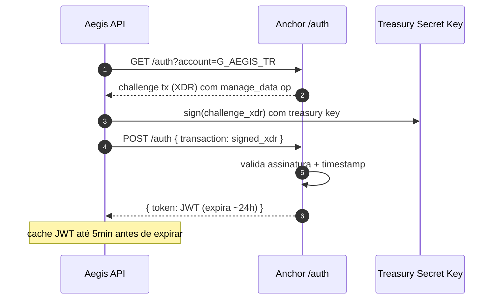
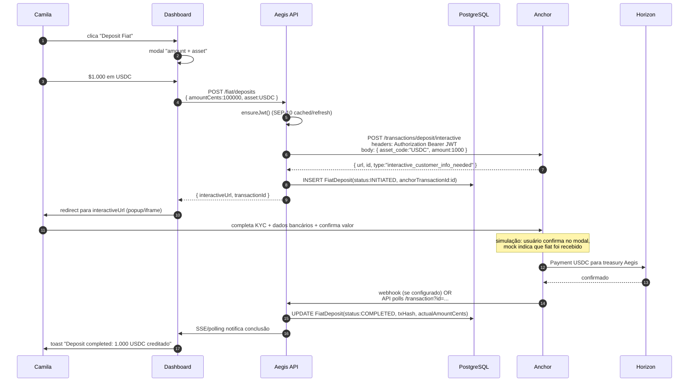
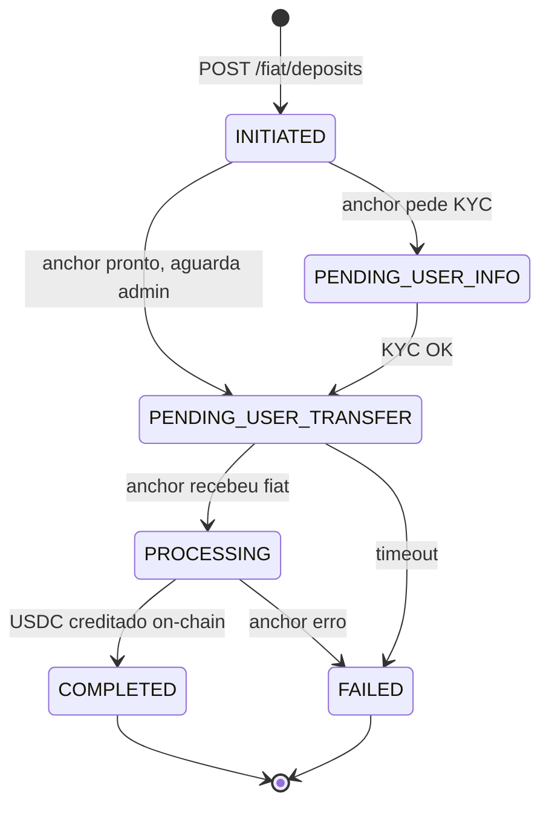

# 06 — Fiat On/Off-ramp (SEP-24)

> Como Aegis integra com anchors SEP-24 para Company depositar fiat (e o agente pagar em USDC) e fazer withdraw (USDC vira fiat na conta bancária). Capability obrigatória do MVP.

---

## 1. Por que isso é diferencial

Stripe Issuing precisa que Company já tenha saldo na Stripe. Cartão corporativo precisa de banco. **A maioria das soluções obrigam o cliente a manter fundo em uma janela específica para o agente.**

Aegis fecha o loop end-to-end:
1. Company envia fiat (BRL/USD/ARS) → vira USDC na treasury Aegis.
2. Agente paga em USDC.
3. Quando Company quer reaver: USDC vira fiat de volta na conta bancária.

E **sem que Aegis precise virar fintech regulada** — quem faz KYC/AML/banking é o anchor SEP-24. Aegis é apenas o cliente.

---

## 2. O que é SEP-24 (em 3 parágrafos)

**SEP** = Stellar Ecosystem Proposal. **SEP-24** é o padrão "Hosted Deposit and Withdrawal" — um protocolo público que define como uma wallet (no nosso caso, a API Aegis atuando em nome da Company) inicia um deposit ou withdrawal via um anchor.

O "hosted" significa que o anchor entrega uma URL interativa (web page) onde o usuário (admin Aegis) faz KYC, fornece dados bancários e completa o fluxo fiat. Aegis não vê PII bancária — só recebe callback/polling com status.

Pré-requisito para SEP-24: **SEP-10** (Stellar Web Authentication). O anchor exige que a Aegis prove ser dona da treasury account via uma challenge transaction assinada. Resultado: um JWT que autentica todas as chamadas SEP-24 subsequentes.

---

## 3. Atores do fluxo

| Ator | Papel |
|------|-------|
| **Admin Aegis (Camila)** | Inicia deposit/withdraw no dashboard, completa KYC no modal interativo do anchor |
| **Aegis API** | Cliente SEP-10/24 — autentica, inicia transação, recebe callbacks, atualiza DB |
| **Anchor (test-anchor)** | Servidor SEP-24: gera challenge, expõe modal interativo, processa fiat, emite/recebe USDC on-chain |
| **Banco do usuário** | Recebe/envia fiat conforme orientado pelo anchor |
| **Horizon** | Confirma a tx Stellar de USDC (deposit: anchor → treasury; withdraw: treasury → anchor) |

---

## 4. Anchor escolhido para o MVP

**Stellar Test Anchor**
- URL: `https://testanchor.stellar.org`
- Stellar TOML: `https://testanchor.stellar.org/.well-known/stellar.toml`
- Capabilities: SEP-1, SEP-10, SEP-12 (KYC mock), SEP-24, SEP-31.
- Asset emitido: USDC testnet (issuer especificado no TOML).
- KYC: **simulado** (qualquer dado válido passa; é um sandbox).
- Banking: **simulado** (não há transferência fiat real; usuário "confirma" no modal e USDC é creditado).

**Por que ele:**
- Mantido pela Stellar Development Foundation.
- Único anchor SEP-24 robusto em testnet.
- Permite desenvolver e demonstrar fluxo end-to-end sem precisar de anchor real.

**Mainnet (Marco 3, futuro):**
- **Circle** (USDC oficial, US): Circle Account API permite mint/burn USDC contra conta bancária.
- **Anclap** (LATAM, BRL/ARS): anchor SEP-24 produção para fiat brasileiro/argentino.
- **MoneyGram Access**: anchor SEP-24 para cash in/out global.

---

## 5. SEP-10 — autenticação

Toda chamada SEP-24 exige JWT. JWT é obtido via SEP-10:



**Implementação:**
```ts
// packages/stellar/src/sep10.ts
async function sep10Authenticate(anchorUrl: string, account: Keypair): Promise<string> {
  // 1. fetch challenge
  const { data: { transaction } } = await axios.get(`${anchorUrl}/auth`, {
    params: { account: account.publicKey() }
  });

  // 2. parse + sign
  const challengeTx = TransactionBuilder.fromXDR(transaction, NETWORK_PASSPHRASE);
  challengeTx.sign(account);

  // 3. submit signed challenge
  const { data: { token } } = await axios.post(`${anchorUrl}/auth`, {
    transaction: challengeTx.toXDR(),
  });

  return token;
}
```

**Cache de JWT:** Aegis API mantém o JWT em memória (ou Redis no Marco 2) por ~23h, renovando 1h antes de expirar.

---

## 6. Fluxo de Deposit (fiat → USDC)

### Sequence


### Estados do FiatDeposit


### Polling vs Webhook
- **Webhook (preferível, configurar quando suportado pelo anchor):** anchor faz POST para `https://aegis-api/v1/anchors/callback` quando status muda.
- **Polling (fallback, default no MVP):** worker periódico (cada 30s) consulta `/transaction?id=...` para deposits em status não-terminal.

---

## 7. Fluxo de Withdrawal (USDC → fiat)

### Sequence
```mermaid
sequenceDiagram
    autonumber
    participant Admin as Camila
    participant Web as Dashboard
    participant API as Aegis API
    participant DB as PostgreSQL
    participant AN as Anchor
    participant H as Horizon

    Admin->>Web: clica "Withdraw Fiat"
    Web->>API: POST /fiat/withdrawals<br/>{ amountCents:50000, asset:USDC }
    API->>API: ensureJwt()
    API->>AN: POST /transactions/withdraw/interactive<br/>body: { asset_code:"USDC", amount:500 }
    AN-->>API: { url, id, account_id (destino USDC), memo, memo_type }
    API->>DB: INSERT FiatWithdrawal(status:INITIATED)
    API-->>Web: { interactiveUrl, transactionId }
    Web->>Admin: redirect para interactiveUrl
    Admin->>AN: completa dados bancários destino
    AN-->>Admin: "confirme envio de USDC para account_id com memo X"

    Note over API: pode iniciar envio USDC automaticamente OU<br/>esperar admin confirmar no dashboard
    Admin->>Web: clica "Confirm send USDC"
    Web->>API: POST /fiat/withdrawals/:id/send-usdc
    API->>H: Payment USDC: treasury → AN.account_id com Memo=memo
    H-->>API: txHash
    API->>DB: UPDATE FiatWithdrawal(status:PROCESSING, txHash)
    API->>AN: polling /transaction?id=... aguarda anchor reconhecer
    AN-->>API: status:completed (fiat enviado ao banco)
    API->>DB: UPDATE FiatWithdrawal(status:COMPLETED)
    Web->>Admin: toast "Withdrawal completed: 500 USDC enviados; fiat em N dias úteis"
```

### Cuidados críticos
- **Memo é obrigatório no Payment para o anchor:** o anchor identifica o withdrawal pelo Memo retornado em `/transactions/withdraw/interactive`. Sem Memo correto, anchor não reconhece e fundos podem ficar perdidos.
- **Validação prévia:** API rejeita confirmação de envio se balance USDC da treasury < amount. (Evita falha mid-flight.)

---

## 8. Configuração via env vars

```bash
# SEP-24 anchor
SEP24_ANCHOR_HOME_DOMAIN=testanchor.stellar.org
SEP24_ANCHOR_TOML_URL=https://testanchor.stellar.org/.well-known/stellar.toml
SEP24_ANCHOR_SIGNING_KEY=G...           # descoberto via TOML, validar SEP-10
SEP24_ANCHOR_TRANSFER_SERVER=https://testanchor.stellar.org/sep24
SEP24_ANCHOR_WEB_AUTH_ENDPOINT=https://testanchor.stellar.org/auth

# Tuning
SEP24_POLLING_INTERVAL_MS=30000
SEP24_JWT_TTL_SECONDS=82800             # 23h
```

**Discovery via TOML:** maioria dos campos pode ser auto-descoberta lendo `https://<domain>/.well-known/stellar.toml`. Implementar como `getAnchorConfig()` em `@aegis/stellar`.

---

## 9. UI no Dashboard

Página `apps/web/app/dashboard/treasury/page.tsx`:

```
┌─────────────────────────────────────────────┐
│  Treasury                                   │
├─────────────────────────────────────────────┤
│  Balance: 1.234,56 USDC                     │
│  Operational XLM: 87 XLM ⚠ (consider top up)│
│                                             │
│  [Deposit Fiat] [Withdraw Fiat]             │
│                                             │
│  Recent Transactions                        │
│  ┌──────────────────────────────────────┐   │
│  │ 2026-05-17 │ Deposit │ +500 USDC  ✓ │   │
│  │ 2026-05-16 │ Withdraw│ -200 USDC  ⏳│   │
│  └──────────────────────────────────────┘   │
└─────────────────────────────────────────────┘
```

Modal de deposit:
- Input: amount (USD).
- Botão "Continue" → chama API → recebe `interactiveUrl` → abre popup.
- Após popup fechar, página continua polling status até COMPLETED ou FAILED.

---

## 10. Erros e edge cases

| Cenário | Comportamento Aegis |
|---------|---------------------|
| Anchor down (HTTP 5xx no SEP-24) | API retorna 503; admin tenta de novo depois |
| JWT expirou no meio da request | API renova SEP-10 automaticamente e retry once |
| Anchor demora >1h no PROCESSING | Sistema alerta admin; admin pode contatar anchor support (em mainnet) |
| User abandona o modal interativo | FiatDeposit fica em PENDING_USER_INFO; timeout 24h → FAILED |
| Withdraw enviado USDC mas anchor não reconhece (memo errado) | DRAMA — fundos travados. Mitigação: validação rigorosa do memo antes do submit Stellar |
| Anchor rejeita por compliance | Status FAILED com `failureReason` retornado pelo anchor |
| Network testnet reset (raro, mas acontece) | Treasury perde XLM/USDC; precisa refundar via Friendbot |

---

## 11. Considerações de produção (Marco 3, fora MVP)

Quando migrar para mainnet, considerar:
- **Múltiplos anchors:** Company escolhe (Circle para USD US, Anclap para BRL, etc.). Schema do anchor no DB.
- **KYC compartilhado:** SEP-12 permite compartilhar dados KYC entre anchors aprovados.
- **Limites:** anchors têm limites diários/mensais; UI mostra antes do submit.
- **Taxas:** anchors cobram (% + flat); UI mostra preview.
- **Settlement time:** fiat real demora 1-5 dias úteis dependendo do anchor; UI educa o admin.
- **Compliance:** termo de uso da Aegis deve referenciar termo dos anchors integrados.

---

## 12. ADR relacionado

Decisão D11 + justificativa detalhada em [`docs/adr/0002-usdc-via-sep24-anchor.md`](adr/0002-usdc-via-sep24-anchor.md) (escopo da decisão de asset) e referência ao plano de roadmap em [`docs/11-roadmap.md`](11-roadmap.md).
