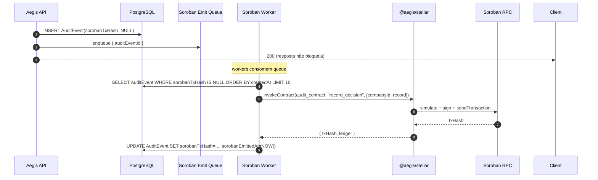

# 08 — Soroban Audit Contract

> Design do contrato `aegis_audit` em Soroban (Rust). Registra cada decisão como evento on-chain consultável via Soroban RPC.

---

## 1. Por que um contrato (e não só Memo)

Cada SpendRequest poderia ter o `spendRequestId` em um `Memo.hash` no Payment. Isso já dá um backup mínimo. **Por que então gastar com Soroban?**

| Capability | Memo apenas | Memo + Soroban event |
|------------|-------------|----------------------|
| Identifica que aquela tx é Aegis | ❌ não distingue de outras txs | ✅ topic `["aegis", "decision", ...]` filtra |
| Carrega dados estruturados (decision, agentId, vendor, amount) | ❌ apenas 32 bytes | ✅ payload tipado completo |
| Auditoria por Company sem ler todas as txs do account | ❌ teria que iterar | ✅ `getEvents` filtra por topic `companyId` |
| Inclui REJECTED (não vira Payment) | ❌ rejeitadas não tocam Stellar | ✅ todas as decisões viram evento |
| Diferencial competitivo "audit cripto-verificável" | ⚠ fraco (só hash) | ✅ rico (decisão completa) |

**Conclusão:** Soroban event é o **recibo cripto-verificável**. Memo é backup defensivo.

---

## 2. Decisão arquitetural: 1 contrato GLOBAL com `companyId` indexado

Decisão **D7** (validada): um único contrato `aegis_audit` deployado para toda a infra Aegis. `companyId` entra como **topic indexado** do evento, permitindo filtragem nativa via Soroban RPC `getEvents`.

**Por que GLOBAL (não um contrato por Company):**
- ✅ Custo zero por Company (deploy único).
- ✅ Operação simples (não precisa orchestration de deploy no onboarding).
- ✅ Filtro por topic é nativo do Soroban RPC (sem risco de vazamento).
- ✅ Upgradabilidade: se mudar o contrato, mudamos uma vez para todos os clientes.
- ⚠ Tenancy é lógica (topic), não cripto. Aceitável para audit (eventos são públicos por design na blockchain).

Para detalhes do trade-off, ver [`docs/adr/0003-soroban-contrato-global.md`](adr/0003-soroban-contrato-global.md).

---

## 3. Especificação do contrato

### 3.1 Tipo `Decision`

```rust
#[contracttype]
#[derive(Clone, Debug, Eq, PartialEq)]
pub enum Decision {
    Approved = 0,
    RequiresApproval = 1,
    Rejected = 2,
    ApprovedByHuman = 3,
    RejectedByHuman = 4,
    Expired = 5,
    ExecutionFailed = 6,
    Executed = 7,
}
```

### 3.2 Payload do evento

```rust
#[contracttype]
#[derive(Clone, Debug, Eq, PartialEq)]
pub struct DecisionRecord {
    pub spend_request_id: BytesN<16>,  // UUID 16 bytes
    pub agent_id: BytesN<16>,
    pub vendor_id: BytesN<16>,
    pub amount_cents: i128,             // valor em centavos (i128 cobre qualquer escala)
    pub asset_code: Symbol,             // "USDC"
    pub decision: Decision,
    pub reason_hash: BytesN<32>,        // sha256(reason string) — texto fica off-chain
    pub timestamp: u64,                 // unix epoch ms
    pub policy_id: BytesN<16>,
    pub policy_version: u32,
}
```

**Por que `reason_hash` e não texto:**
- Storage on-chain é caro; texto livre pode ser longo.
- Hash basta para prova de integridade ("eu já tinha esse texto antes"; comprovado por exibir texto + verificar hash).
- Texto fica em `AuditEvent.payload` no DB.

### 3.3 Funções públicas

```rust
#[contract]
pub struct AegisAudit;

#[contractimpl]
impl AegisAudit {
    /// Inicialização: define quem é o admin autorizado.
    /// Chamada uma única vez no deploy.
    pub fn initialize(env: Env, admin: Address) {
        if env.storage().instance().has(&DataKey::Admin) {
            panic!("already initialized");
        }
        env.storage().instance().set(&DataKey::Admin, &admin);
    }

    /// Registra uma decisão. Emite evento com topics:
    ///   ["aegis", "decision", company_id]
    /// e data = DecisionRecord.
    pub fn record_decision(
        env: Env,
        company_id: BytesN<16>,
        record: DecisionRecord,
    ) {
        let admin: Address = env.storage().instance().get(&DataKey::Admin).unwrap();
        admin.require_auth();  // só treasury Aegis pode invocar

        let topics = (Symbol::new(&env, "aegis"), Symbol::new(&env, "decision"), company_id);
        env.events().publish(topics, record);
    }

    /// Lê admin atual (visualização pública).
    pub fn get_admin(env: Env) -> Address {
        env.storage().instance().get(&DataKey::Admin).unwrap()
    }

    /// Permite admin transferir admin role (rotação de chave futura).
    pub fn set_admin(env: Env, new_admin: Address) {
        let current_admin: Address = env.storage().instance().get(&DataKey::Admin).unwrap();
        current_admin.require_auth();
        env.storage().instance().set(&DataKey::Admin, &new_admin);
    }
}

#[contracttype]
enum DataKey {
    Admin,
}
```

**Decisões de design:**
- **Sem storage de eventos:** eventos vão pro event log do ledger (queryable via RPC), não pro storage do contrato. Mais barato.
- **`require_auth()`:** só a treasury Aegis (admin) pode invocar `record_decision`. Garante que ninguém spamma eventos falsos.
- **`set_admin`:** suporta rotação da chave da treasury sem redeploy.

---

## 4. Como consultar eventos

### 4.1 Soroban RPC `getEvents`

```bash
curl -X POST https://soroban-testnet.stellar.org \
  -H "Content-Type: application/json" \
  -d '{
    "jsonrpc": "2.0",
    "id": 1,
    "method": "getEvents",
    "params": {
      "startLedger": 47800000,
      "filters": [{
        "type": "contract",
        "contractIds": ["C_AEGIS_AUDIT_CONTRACT"],
        "topics": [
          ["AAAADwAAAAVhZWdpcw==", "AAAADwAAAAhkZWNpc2lvbg==", "AAAAEAAAAAEAAAACAAAAAQAAAAA..."]
        ]
      }],
      "pagination": { "limit": 100 }
    }
  }'
```

- `startLedger` é obrigatório; usar lookback razoável.
- `topics` na ordem `["aegis", "decision", "<companyId XDR base64>"]`.
- Resposta inclui ledger, txHash, data (DecisionRecord codificado em XDR).

### 4.2 Em TypeScript via `@stellar/stellar-sdk`

```ts
import { rpc } from '@stellar/stellar-sdk';

const sorobanRpc = new rpc.Server('https://soroban-testnet.stellar.org');

const events = await sorobanRpc.getEvents({
  startLedger: latestLedger - 100_000,
  filters: [{
    type: 'contract',
    contractIds: [AUDIT_CONTRACT_ID],
    topics: [
      [
        nativeToScVal('aegis', { type: 'symbol' }).toXDR('base64'),
        nativeToScVal('decision', { type: 'symbol' }).toXDR('base64'),
        nativeToScVal(companyIdBytes, { type: 'bytes' }).toXDR('base64'),
      ]
    ]
  }],
  limit: 100,
});

// decodificar value para DecisionRecord
for (const ev of events.events) {
  const record = scValToNative(xdr.ScVal.fromXDR(ev.value, 'base64'));
  console.log(record); // { spend_request_id, decision, amount_cents, ... }
}
```

---

## 5. Como Aegis emite o evento (fluxo do orchestrator)



**Retry behavior:**
- Backoff exponencial: 1s, 5s, 30s, 5min, 30min.
- Após 5 tentativas, escalar para Sentry/PagerDuty.
- Worker idempotente: usa `auditEvent.id` como chave; se já tem `sorobanTxHash`, pula.

**Por que async:**
- API response não pode bloquear ~5s aguardando ledger Soroban.
- Decisão off-chain (DB) é fonte de verdade primária; Soroban é prova externa.
- Eventual consistency aceitável para audit (não há decisão crítica dependendo do evento).

---

## 6. Deploy do contrato

### 6.1 Build
```bash
cd contracts/aegis-audit
cargo build --target wasm32-unknown-unknown --release
# output: target/wasm32-unknown-unknown/release/aegis_audit.wasm
```

### 6.2 Deploy (testnet)
```bash
# pré-requisito: stellar-cli configurada com identity 'treasury'
stellar contract deploy \
  --wasm target/wasm32-unknown-unknown/release/aegis_audit.wasm \
  --source treasury \
  --network testnet
# output: contract ID C...

# inicializar
stellar contract invoke \
  --id C_AEGIS_AUDIT_CONTRACT \
  --source treasury \
  --network testnet \
  -- \
  initialize \
  --admin G_AEGIS_TR
```

### 6.3 Registrar contract ID
- Salvar em env var `AUDIT_CONTRACT_ID`.
- Persistir em `TreasuryAccount.auditContractId` (campo do DB).
- Documentar no README ou ops runbook.

### 6.4 Upgrade (futuro)
- Soroban suporta upgradeable contracts via `update_current_contract_wasm()`.
- No MVP, o contrato é simples; upgrade não é prioridade.
- Para Marco 2+, considerar admin multisig para upgrades.

---

## 7. Custo de gas

Aproximação testnet/mainnet:
- **Deploy** do contrato: ~0.5 XLM uma vez.
- **Invoke `record_decision`:** ~0.001 XLM por chamada (publicação de evento sem storage é barata).
- **`initialize`:** ~0.001 XLM uma vez.

Volume MVP: 1000 spend requests/dia → ~1 XLM/dia em fees Soroban. Negligível.

---

## 8. Limitações e considerações

### 8.1 Privacy
Eventos Soroban são públicos. Por isso `companyId` no topic é OK (não identifica empresa por si só; só quem tem o mapping companyId↔empresa real saberia), mas:
- `reason_hash` (não texto) protege descrições potencialmente sensíveis.
- `agent_id`, `vendor_id` são UUIDs internos; não vazam nomes reais.
- `amount_cents` é exposto. Se for sensível, considerar agregar (round para mais próximo $100) — não no MVP.

### 8.2 Throughput
Soroban testnet processa ~10 invocações/segundo. Suficiente para o MVP. Mainnet escala mais, mas se Aegis tiver volume muito alto no futuro, considerar batching (1 invocação com array de records).

### 8.3 Disponibilidade do Soroban RPC
- Down do RPC → eventos ficam queued no DB.
- Worker retry recupera quando RPC volta.
- Frontend de audit pode mostrar "evento on-chain: pending" para eventos não-emitidos ainda.

---

## 9. Verificação ponta-a-ponta para o admin

UI no dashboard `/audit/:id`:
```
┌─────────────────────────────────────────┐
│ Audit Event #abc-123                    │
├─────────────────────────────────────────┤
│ Type:      DECISION_MADE                │
│ Actor:     agent:550e... (CS Bot)       │
│ Time:      2026-05-17 14:32:18 UTC      │
│                                         │
│ Payload:                                │
│   decision:         APPROVED            │
│   vendor:           Anthropic           │
│   amount:           $15.00 USDC         │
│   policy:           Default Policy v3   │
│                                         │
│ On-chain proof:                         │
│   Soroban tx:  abc...                   │
│   Ledger:      47823901                 │
│   [Verify on Stellar Expert ↗]          │
│   Topic match: ["aegis","decision",co]  │
└─────────────────────────────────────────┘
```

Botão "Verify" abre Stellar Expert URL apontando para a tx Soroban. Admin (ou auditor externo) pode validar a integridade pela RPC sem confiar na Aegis.
